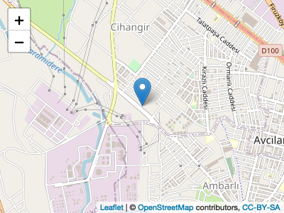
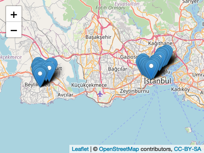

<!-- README.md is generated from README.Rmd. Please edit that file -->


# MAKibb by Mustafa Atakan Kızıltan

<!-- badges: start -->

<!-- badges: end -->

The goal of MAKibb is to reach easily Istanbul Metropolitan Municipality
web services.

Thank you to *Zülal T. Yıldırım* for her contributions.

## Installation

You can install the released version of MAKibb from
[CRAN](https://CRAN.R-project.org) with:

``` r
library(devtools)
devtools::install_github("atakzltn/MAKibb")
```

## get\_durak Function

>   - You can reach line code, line name, line situation, area and
>     journey time instantly with this function.
>   - You can query with/without with linecode.

``` r
library(MAKibb)
head(get_durakdetay(linecode="145T"),5)
#>   HATKODU YON SIRANO DURAKKODU XKOORDINATI YKOORDINATI        DURAKADI
#> 1    145T   D      1    303421   28,988844   41,039606 GÜMÜŞSUYU PERON
#> 2    145T   D      2    181842   28,984631   41,037919    TAKSİM TÜNEL
#> 3    145T   D      3    117472   28,980185   41,036589       TARLABAŞI
#> 4    145T   D      4    117462   28,976022   41,035728     ÖMER HAYYAM
#> 5    145T   D      5    117452   28,974072   41,032916        TEPEBAŞI
#>    DURAKTIPI ILCEADI
#> 1 İETTBAYRAK Beyoğlu
#> 2 AÇIK DURAK Beyoğlu
#> 3 İETTBAYRAK Beyoğlu
#> 4 WALLMODERN Beyoğlu
#> 5 WALLMODERN Beyoğlu
```

## get\_hatdetay Function

>   - You can reach all the route and bus stop information instantly
>     with this function.
>   - You can query with/without with linecode.

``` r
library(MAKibb)
head(get_hatdetay(),5)
#>   HATKODU                     HATADI HATDURUMU    BOLGE SEFERSURESI
#> 1   AND1A         ANADOLU1 / ANADOLU         1 Anadolu1          10
#> 2  AND1A3   ANADOLU1 DEPAR / ANADOLU         1 Anadolu2          10
#> 3   AND1Ş ANADOLU1 DEPAR / ŞAHİNKAYA         1 Anadolu1          10
#> 4   AND2S  ANADOLU2 DEPAR / SARIGAZİ         0 Anadolu2          10
#> 5   AND2Y     ANADOLU2 DEPAR / YUNUS         1 Anadolu2        6.67
```

## get\_bozukyol Function

>   - You can reach instant bad road information.
>   - This information is the information that comes to the bus driver
>     screens. For this reason, you can also query bad roads by the bus
>     door number

``` r
library(MAKibb)
head(get_bozukyol(),5)
#>     boylam    enlem kapinumarasi
#> 1 28.60621 41.18517        O1161
#> 2 28.87162 41.03640        O1245
#> 3 28.88274 41.01979        O1245
#> 4 29.27608 40.91418        O3255
#> 5 28.94499 41.07282        K1536
```

## get\_lokasyon Function

>   - You can reach location and speed (km/h) of any bus with/without
>     number plate.
>   - Number plate parameter is not mandatory. You can query
>     with/without number plate.

``` r
library(MAKibb)
head(get_lokasyon(),5)
#>   Operator  Garaj KapiNo  Saat    Boylam     Enlem Hiz      Plaka
#> 1     İETT  G_IKT  B5308 13:23   28.7909  41.05983   0 34 NL 8219
#> 2     İETT  G_IKT  B5323 13:23 28.791906 41.059628   0 34 NL 8204
#> 3     İETT PG_TPK  B5338 13:24  28.92797 41.016773   0 34 NL 8197
#> 4     İETT PG_TPK  B5353 13:23 28.885162  40.99564   0 34 NL 8191
#> 5     İETT PG_TPK  B5368 13:23 28.928314 41.016945   0 34 NL 8173
```

## get\_duyuru Function

>   - You can reach daily announcements by type and bus line.

``` r
library(MAKibb)
head(get_duyuru(),5)
#>      Tip  Hat Güncelleme
#> 1 Günlük  KÇ2      13:17
#> 2 Günlük  11T      13:17
#> 3 Günlük  89K      13:17
#> 4 Günlük 98AB      13:17
#> 5 Günlük 36AS      13:09
#>                                                                                                                                                                                    Mesaj
#> 1                                                                                                                                KAPALI OLAN INÖNÜ MAHALLESI GÜZERGAHI NORMALE DÖNMÜŞTÜR
#> 2                                                                                                                                                KOŞUYOLU GÜZERGAHIMIZ NORMALE DÖNMÜŞTÜR
#> 3                                                                                                                                KAPALI OLAN INÖNÜ MAHALLESI GÜZERGAHI NORMALE DÖNMÜŞTÜR
#> 4                                                                                                                                KAPALI OLAN INÖNÜ MAHALLESI GÜZERGAHI NORMALE DÖNMÜŞTÜR
#> 5 TAŞOLUK YÖNÜ KAZIM KARABEKIR CADDESI YOL ÇALIŞMASI NEDENIYLE KAPALIDIR.OTOBÜSLER 66.KIPTAŞ KONUTLARI DURAĞINDAN GÜZERGAHTAN ÇIKARAK 68.TAŞOLUK YEŞIL CAMII DURAĞINDAN GÜZERGAHA GIRER.
```

## plot\_lokasyon Function

>   - You can see the bus location that you want in a map.

``` r
library(MAKibb)
plot_lokasyon(numberplate="34 NL 7572")
```



## plot\_guzergah Function

>   - You can see the bus line route that you want in a map. You can
>     reach all bus lines with get\_hatdetay() function.

>   - linecode is not mandatory. You can query bus line with bus line
>     code.

``` r
library(MAKibb)
plot_guzergah(linecode="145T")
```



See [linked
phrase](https://data.ibb.gov.tr/organization/iett-genel-mudurlugu) for
more information.
